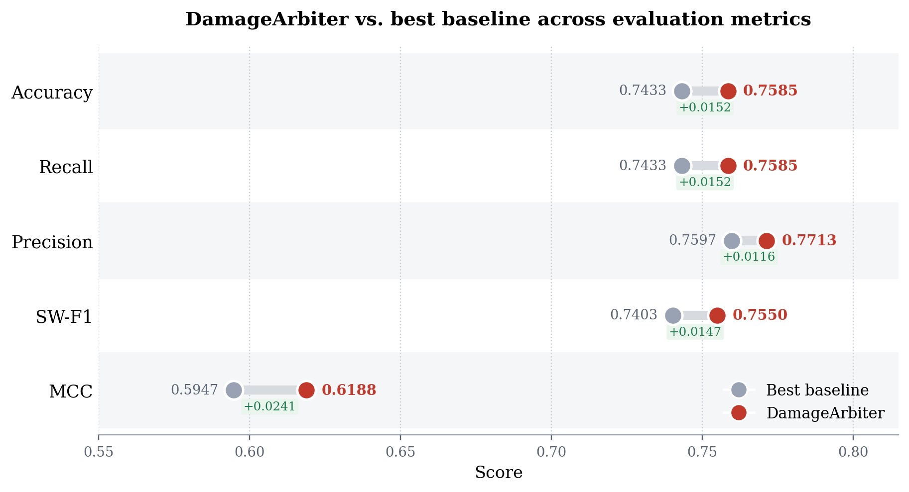
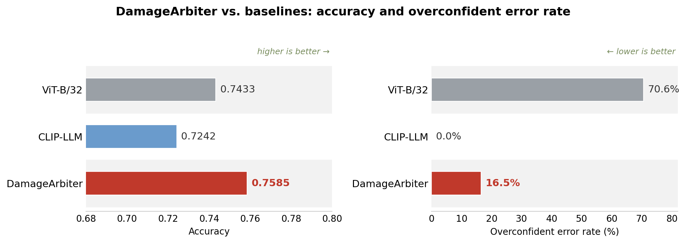
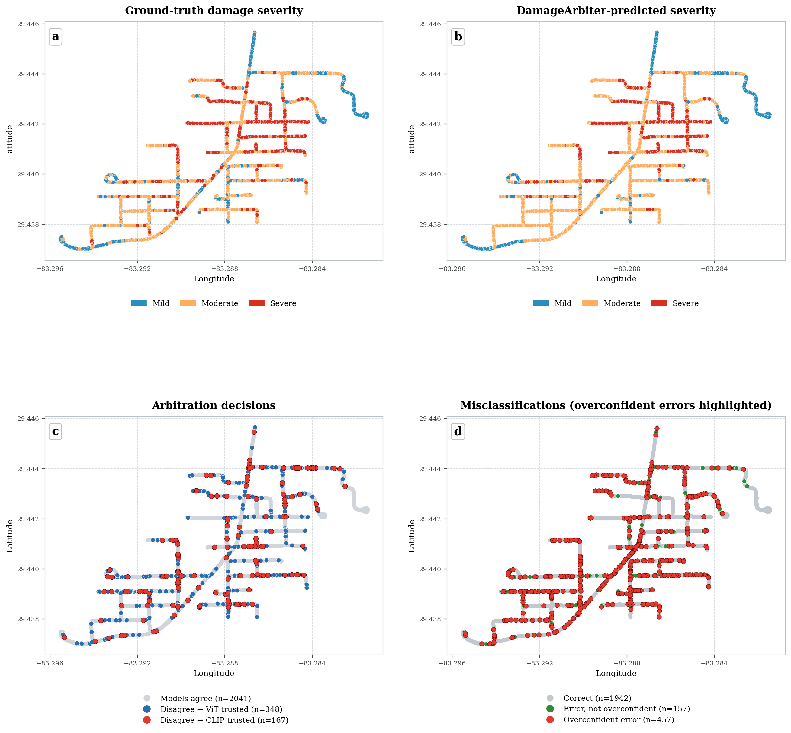

# DamageArbiter

**A CLIP-Enhanced Multimodal Arbitration Framework for Hurricane Damage Assessment from Street-View Imagery**

[](https://arxiv.org/abs/2603.14837)
[](https://doi.org/10.6084/m9.figshare.28801208.v2)
[](https://huggingface.co/datasets/Rayford295/BiTemporal-StreetView-Damage)

---

## Overview

DamageArbiter is a **disagreement-driven arbitration framework** for street-view-based disaster damage assessment. It combines a **Vision Transformer (ViT)** image model with a **CLIP** image-text model through a lightweight logistic-regression meta-classifier that arbitrates the cases where the two models disagree. When the two models agree, DamageArbiter adopts **CLIP's more conservative confidence**, so the arbitrated predictions inherit a more reliable confidence profile. On 2,556 post-disaster street-view images from Hurricane Milton, DamageArbiter improves accuracy to **75.85%** and the Matthews correlation coefficient (MCC) to **0.619** using only inference-time features, while reducing the share of overconfident errors from **70.58%** (image-only baseline) to **16.5%** without changing accuracy.

<p align="center">
  
</p>

---

## Demo

<p align="center">
  <a href="https://www.youtube.com/watch?v=MCvd-wD7Fw4">
    
  </a>
</p>

---

## Figures

| Study Area | Label Example |
|:---:|:---:|
|  |  |

| DamageArbiter vs. Best Baseline | Accuracy vs. Overconfidence |
|:---:|:---:|
|  |  |

| Spatial Deployment in Horseshoe Beach |
|:---:|
|  |

The spatial-deployment figure shows, for every street-view location, the ground-truth severity, the DamageArbiter-predicted severity, where the arbitrator trusted ViT versus CLIP, and the misclassified locations with overconfident errors highlighted.

---

## Code

- `code/ViT-B16.py` and `code/clip-enhance/`: image-only, text-only, and multimodal CLIP baselines.
- `code/arbitration/damage_arbiter.py`: the disagreement-driven, label-free arbitrator.
- `code/LLM-label/`: GPT and Gemini caption generation.
- `code/calibration/temperature_scaling.py`: optional post-hoc confidence calibration (temperature scaling) utility.

## Dataset

Pre- and post-disaster street-view imagery collected from **Horseshoe Beach, Florida** following **Hurricane Milton**, with georeferenced annotations and damage severity labels (*mild / moderate / severe*).

- **Figshare:** [10.6084/m9.figshare.28801208.v2](https://doi.org/10.6084/m9.figshare.28801208.v2)
- **Hugging Face:** [Rayford295/BiTemporal-StreetView-Damage](https://huggingface.co/datasets/Rayford295/BiTemporal-StreetView-Damage)

---

## Recognition

Accepted at the **AAG Annual Meeting 2026** — GIS Specialty Group Student Honors Paper Competition
**2nd Place Award**
Session: Imperial B, Ballroom Level, Hilton Union Square — March 17, 2026, 4:10–5:30 PM

---

## Citation

```bibtex
@article{yang2026damagearbiter,
  title={DamageArbiter: A CLIP-Enhanced Multimodal Arbitration Framework for Hurricane Damage Assessment from Street-View Imagery},
  author={Yang, Yifan and Zou, Lei and Gong, Wenjing and Fu, Kani and Li, Zongrong and Wang, Siqin and Zhou, Bing and Cai, Heng and Tian, Hao},
  journal={arXiv preprint arXiv:2603.14837},
  year={2026}
}
```

---

## Contact

**Yifan Yang** — Department of Geography, Texas A&M University
[yyang295@tamu.edu](mailto:yyang295@tamu.edu) · [rayford295.github.io](https://rayford295.github.io)

> All materials in this repository are for academic research purposes only. Please contact the author before reuse or redistribution.
