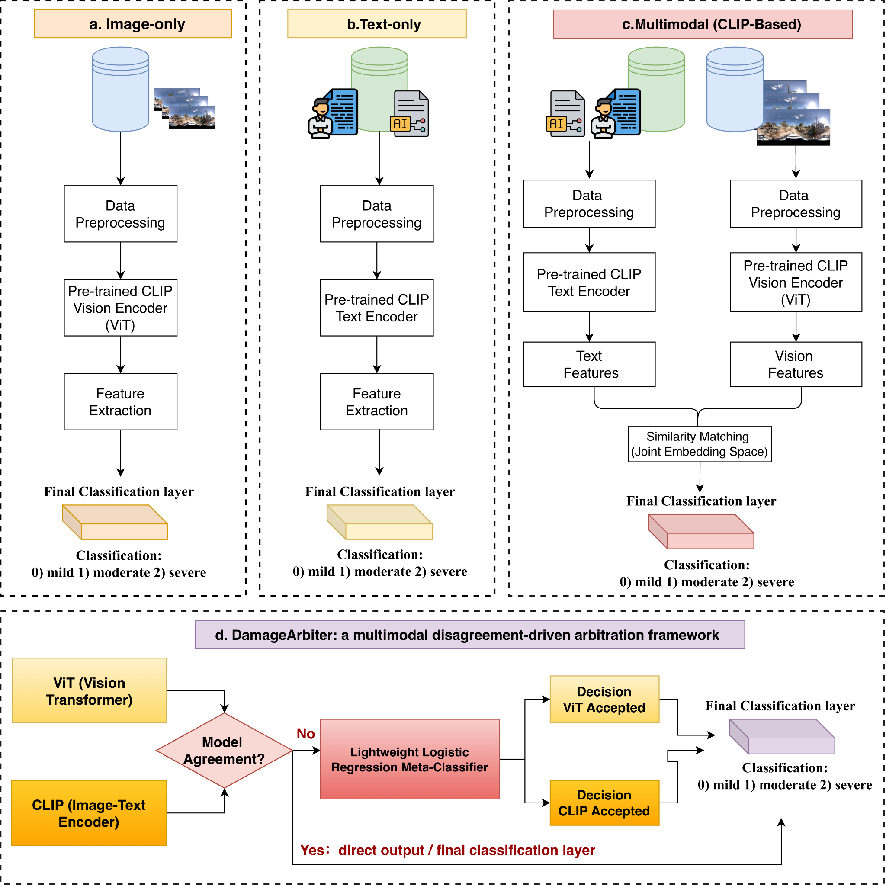
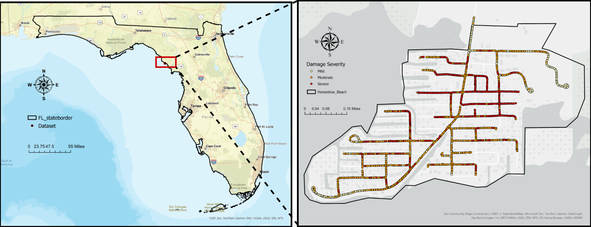
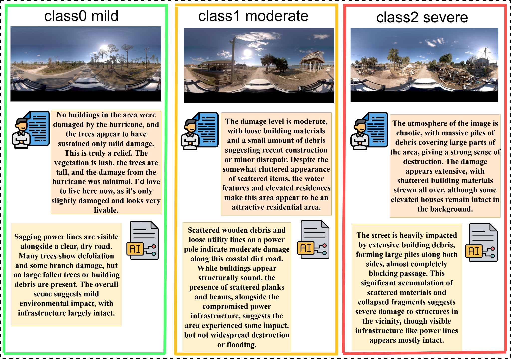
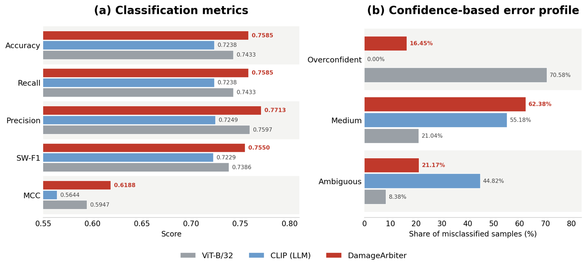

# DamageArbiter

**A Multimodal Arbitration Framework for Disaster Damage Assessment from Street-View Imagery**

[](https://arxiv.org/abs/2603.14837)
[](https://doi.org/10.6084/m9.figshare.28801208.v2)
[](https://huggingface.co/datasets/Rayford295/BiTemporal-StreetView-Damage)

[Latest manuscript PDF](DamageArbiter.pdf)

---

## Overview

DamageArbiter is a **multimodal, disagreement-driven arbitration framework** for street-view-based disaster damage assessment. Existing approaches typically rely on black-box pre-trained vision models that lack interpretability and reliability. DamageArbiter leverages the complementary strengths of unimodal and multimodal models and employs a lightweight logistic-regression meta-classifier to arbitrate the cases in which model predictions disagree.

Using **2,556 post-disaster street-view images** collected after Hurricane Milton in Horseshoe Beach, Florida, each paired with human-written and LLM-generated descriptions, we compare DamageArbiter against fine-tuned image-only, text-only, and CLIP-based multimodal baselines on both classification performance and overconfidence. DamageArbiter improves accuracy to **75.85%** and the Matthews correlation coefficient (MCC) to **0.6188**, surpassing the best text-only baseline (63.07% accuracy, 0.4126 MCC), image-only baseline (74.33% accuracy, 0.5947 MCC), and CLIP baseline (74.22% accuracy, 0.5915 MCC). Crucially, it reduces overconfident errors from **70.58%** for the image-only ViT-B/32 baseline to **16.45%**, demonstrating that accuracy alone is insufficient for evaluating disaster damage models and that overconfidence should be reported as part of reliability assessment.

<p align="center">
  
</p>

---

## Figures

| Study Area | Label Example |
|:---:|:---:|
|  |  |

| ViT-B/32, CLIP-LLM, and DamageArbiter across performance and reliability metrics |
|:---:|
|  |

| Spatial Deployment in Horseshoe Beach |
|:---:|
|  |

The spatial-deployment figure shows, for every street-view location, the ground-truth severity, the DamageArbiter-predicted severity, where the arbitrator trusted ViT versus CLIP, and the misclassified locations with overconfident errors highlighted.

---

## Code

- `code/vit_baseline_oof.py` and `code/clip-enhance/`: image-only ViT and CLIP-based multimodal baselines.
- `code/arbitration/damage_arbiter.py`: the disagreement-driven arbitrator used for the final DamageArbiter evaluation.
- `code/LLM-label/`: GPT and Gemini caption generation.
- `code/calibration/temperature_scaling.py`: optional confidence-calibration utility for additional diagnostics.

## Dataset

The experiments use the Milton-SV post-disaster street-view subset collected from **Horseshoe Beach, Florida** after **Hurricane Milton**, with damage severity labels (*mild / moderate / severe*) and human- or LLM-generated descriptions.

- **Figshare:** [10.6084/m9.figshare.28801208.v2](https://doi.org/10.6084/m9.figshare.28801208.v2)
- **Hugging Face:** [Rayford295/BiTemporal-StreetView-Damage](https://huggingface.co/datasets/Rayford295/BiTemporal-StreetView-Damage)

---

## Recognition

Accepted at the **AAG Annual Meeting 2026** — GIS Specialty Group Student Honors Paper Competition
**2nd Place Award**
Session: Imperial B, Ballroom Level, Hilton Union Square — March 17, 2026, 4:10–5:30 PM

---

## Citation

```bibtex
@article{yang2026damagearbiter,
  title={DamageArbiter: A Multimodal Arbitration Framework for Disaster Damage Assessment from Street-View Imagery},
  author={Yang, Yifan and Zou, Lei and Gong, Wenjing and Fu, Kani and Li, Zongrong and Wang, Siqin and Zhou, Bing and Cai, Heng and Tian, Hao},
  journal={arXiv preprint arXiv:2603.14837},
  year={2026}
}
```

---

## Contact

**Yifan Yang** — Department of Geography, Texas A&M University
[yyang295@tamu.edu](mailto:yyang295@tamu.edu) · [rayford295.github.io](https://rayford295.github.io)

> All materials in this repository are for academic research purposes only. Please contact the author before reuse or redistribution.
